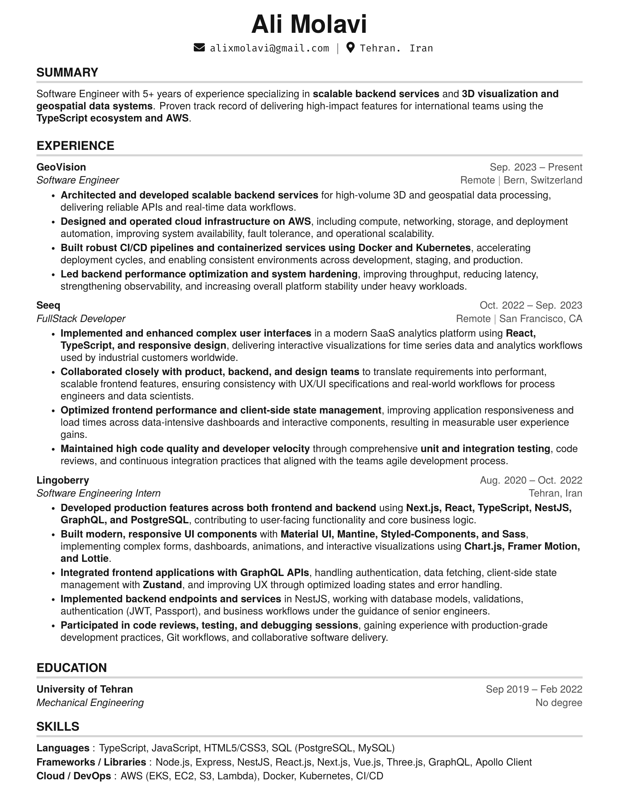

<h1 align="center">Ali Molavi - Resume</h1>

<p align="center">
  <a href="./resume.pdf"><strong>View or download the PDF</strong></a>
  &nbsp;&middot;&nbsp;
  <a href="./resume.tex">View the LaTeX source</a>
</p>

<p align="center">
  <a href="./resume.pdf">
    
  </a>
</p>

## Update workflow

With VS Code and LaTeX Workshop installed, saving `resume.tex` automatically:

1. Compiles `resume.tex` and replaces `resume.pdf`.
2. Converts the new PDF and replaces `resume.png`.

To run the same workflow manually:

```sh
tectonic --outdir . resume.tex
pdftoppm -png -singlefile -r 180 resume.pdf resume
```
